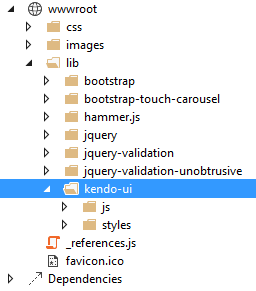

# Including Client-Side Resources

This article demonstrates how to include the client-side resources which are required by Telerik® UI for ASP.NET Core in Visual Studio 2017 projects.

As the UI for ASP.NET Core suite is a set of [server-side wrappers over the Kendo UI for jQuery client-side widgets](https://docs.telerik.com/aspnet-mvc/getting-started/kendo-ui-vs-mvc-wrappers), to run the components, you have to provide the same set of web assets. For more information on the files you need, refer to the articles on:

* [Getting Started with Kendo UI for jQuery](https://docs.telerik.com/kendo-ui/intro/first-steps)
* [Getting Started with Kendo UI Themes](http://docs.telerik.com/kendo-ui/styles-and-layout/appearance-styling#getting-started)

To include the client-side resources, use any of the following approaches:

* (Demonstrated in this guide) [Manual installation](#manual-installation)
* [Using Bower]()
* [Using NPM and Webpack]()

1. Go to the [UI for ASP.NET Core download page](https://www.telerik.com/account/product-download?product=UIASPCORE) or to **Account Overview** > **Downloads** > **Telerik UI for ASP.NET Core**.
1. Download the archive that matches the `Kendo.Mvc.UI` version:

    - `telerik.ui.for.aspnet.core.{{ site.mvcCoreVersion }}.commercial-source` includes non-minified scripts and styles.
    - `telerik.ui.for.aspnet.core.{{ site.mvcCoreVersion }}.commercial` includes minified scripts and styles.

1. Copy the `js` and `styles` folders from the archive to your project under `wwwroot\lib\kendo-ui`.

   

1. Register the UI styles and scripts in `~/Views/Shared/_Layout.cshtml`.

    > * The CDN links and/or package versions have to point to the same UI for ASP.NET Core version which your project references.
    > * In the default .NET Core template, the jQuery scripts are included at the end of the `<body>` element. To properly load the Telerik UI for ASP.NET HTML Helpers, move the jQuery scripts and the Kendo UI client-side scripts to the `<head>` element and make sure that the Kendo UI scripts are loaded after the jQuery ones.

        <head>
            ...

            <environment include="Development">
                ...

                <link rel="stylesheet" href="~/lib/kendo-ui/styles/kendo.common-nova.min.css" />
                <link rel="stylesheet" href="~/lib/kendo-ui/styles/kendo.nova.min.css" />
            </environment>
            <environment exclude="Development">
                ...

                <link rel="stylesheet"
                    href="https://kendo.cdn.telerik.com/{{ site.cdnVersion }}/styles/kendo.common-nova.min.css"
                    asp-fallback-href="~/lib/kendo-ui/styles/kendo.common-nova.min.css"
                    asp-fallback-test-class="k-common-test-class"
                    asp-fallback-test-property="opacity" asp-fallback-test-value="0" />

                <link rel="stylesheet"
                    href="https://kendo.cdn.telerik.com/{{ site.cdnVersion }}/styles/kendo.nova.min.css"
                    asp-fallback-href="~/lib/kendo-ui/styles/kendo.nova.min.css"
                    asp-fallback-test-class="k-theme-test-class"
                    asp-fallback-test-property="opacity" asp-fallback-test-value="0" />
            </environment>

            <environment include="Development">
                ...

                

                @* Place the Kendo UI scripts after jQuery. *@
                
                
            </environment>
            <environment exclude="Development">
                ...

                

                @* Place the Kendo UI scripts after jQuery. *@
                
                
            </environment>

            ...
        </head>

## See Also

* [Introduction to Telerik UI for ASP.NET Core]()
* [First Steps on Visual Studio for Windows (Online Guide)]()
* [First Steps on Visual Studio for Mac (Online Guide)]()
* [First Steps with CLI (Online Guide)]()
