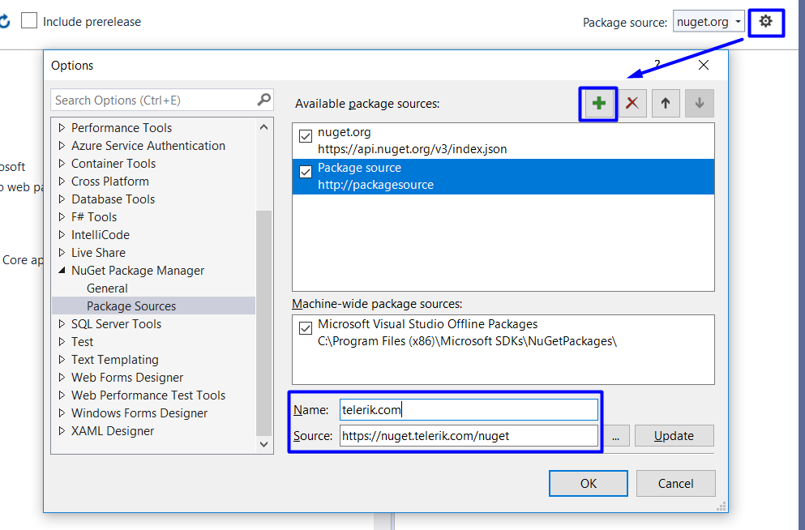

# Installing with NuGet

Telerik maintains a NuGet Feed for registered users.

[NuGet](https://www.nuget.org) is a popular .NET package manager. Official releases and service packs of UI for ASP.NET MVC are available for registered users.

## The Telerik Private NuGet Feed

To use the Telerik NuGet Feed as a Package Source, use the [NuGet CLI](http://docs.nuget.org/consume/Command-Line-Reference). Or, use the UI provided from Visual Studio for configuring authenticated NuGet feeds.

The following video explains how you can add the Telerik NuGet feed. If you prefer to do this yourself, follow the rest of this article.

<iframe width="560" height="315" src="https://www.youtube.com/embed/c3m_BLMXNDk" frameborder="0" allow="accelerometer; autoplay; encrypted-media; gyroscope; picture-in-picture" allowfullscreen></iframe>

### Setup with NuGet CLI

1. Download the [latest NuGet executable](https://dist.nuget.org/win-x86-commandline/latest/nuget.exe).
1. Open a command prompt and change the path to where the `nuget.exe` is downloaded. 
1. The command from the example below stores a token in the `%AppData%\NuGet\NuGet.config` file. Your original credentials cannot be obtained from this token.

    ```
        NuGet Sources Add -Name "telerik.com" -Source "https://nuget.telerik.com/nuget" -UserName "your login email" -Password "your password"
    ```

    If you are unable to connect to the feed by using encrypted credentials, try the alternative approach of storing credentials in clear text.

    ```
        NuGet Sources Add -Name "telerik.com" -Source "https://nuget.telerik.com/nuget" -UserName "your login email" -Password "your password" -StorePasswordInClearText
    ```

    If you have already stored a token instead of storing the credentials as clear text, you could update the definition in the `%AppData%\NuGet\NuGet.config` file using the following command:

    ```
        NuGet Sources Update -Name "telerik.com" -Source "https://nuget.telerik.com/nuget" -UserName "your login email" -Password "your password" -StorePasswordInClearText
    ```

### Setup with NuGet Package Manager

1. Open Visual Studio.

1. Go to **Tools > NuGet Package Manager > Package Manager Settings**, select Package Manager Sources and then click the + button.

1. Choose feed Name, set the feed URL to: https://nuget.telerik.com/nuget and click OK.

    

1. Choose the `Browse` list of packages.

1. Enter your Telerik credentials in the Windows Authentication dialog.

1. All of the packages that are licensed to the user account are available in Visual Studio Package Manager.

### Installing the NuGet Packages

After setting up the source, install the packages either through the [Package Manager Console](http://docs.nuget.org/Consume/Package-Manager-Console) or through the [Package Manager Dialog](https://docs.nuget.org/consume/package-manager-dialog).

## List of Provided Packages

The NuGet feed provides the following packages related to Telerik UI for ASP.NET MVC:

- `Telerik.UI.for.AspNet.Mvc5`&mdash;Telerik UI for ASP.NET MVC 5 Commercial.
- `Telerik.UI.for.AspNet.Mvc5.Trial`&mdash;Telerik UI for ASP.NET MVC 5 Trial.
- `Telerik.UI.for.AspNet.Mvc4`&mdash;Telerik UI for ASP.NET MVC 4 Commercial.
- `Telerik.UI.for.AspNet.Mvc4.Trial`&mdash;Telerik UI for ASP.NET MVC 4 Trial.
- `Telerik.UI.for.AspNet.Mvc3`&mdash;Telerik UI for ASP.NET MVC 3 Commercial.
- `Telerik.UI.for.AspNet.Mvc3.Trial`&mdash;Telerik UI for ASP.NET MVC 3 Trial.

For more information on the list of the provided Kendo UI packages, refer to the article on [installing Kendo UI for jQuery with NuGet](https://docs.telerik.com/kendo-ui/intro/installation/nuget-install).

## Troubleshooting

This section provides solutions for common issues you might encounter while using the Kendo UI NuGet feed.

### After changing my Telerik password, I get [Telerik Nuget] The V2 feed at '...' returned an unexpected status code '401 Logon failed.' error

After changing your Telerik password, you need to reset your credentials in the `NuGet.config` file. To do this, run the `NuGet Sources Update -Name "telerik.com" -Source "https://nuget.telerik.com/nuget" -UserName "your login email" -Password "your new password"` command.

### The NuGet package takes too long to install or update on Visual Studio

* Disable the auto-sync in the `_references.js` file by modifying the following `/// <autosync enabled="false" />` line.
* You can also disconnect the project from the source control before running the Update Wizard.

## See Also

* [Telerik UI for ASP.NET MVC Fundamentals]()
* [Scaffolding the Telerik UI for ASP.NET MVC Project]()
* [Using Telerik UI for ASP.NET MVC in MVC 5 Applications]()
* [Using Telerik UI for ASP.NET MVC in MVC 4 Applications]()
* [Using Telerik UI for ASP.NET MVC in MVC 3 Applications]()
* [Set Up Private NuGet Feed for Azure](https://docs.telerik.com/aspnet-core/knowledge-base/setup-private-nuget-feed-azure)
