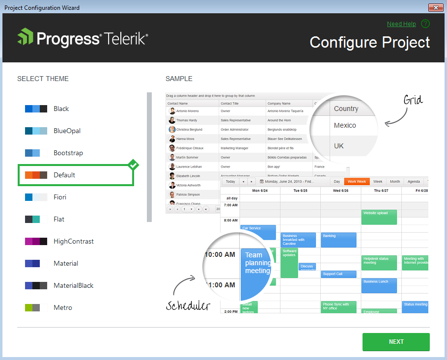
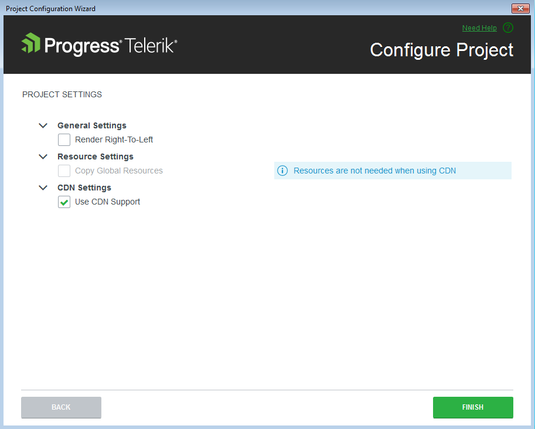

# Configuring Projects

This article demonstrates how to configure a Progress&reg; Telerik&reg; UI for ASP.NET MVC application.

## The Basics

The **Project Configuration Wizard** configures the visual theme and project settings of existing Telerik UI for ASP.NET MVC applications. To open the **Project Configuration Wizard**, click **Telerik** > **Telerik UI for ASP.NET MVC** > **Configure Project**.

## Visual Themes

The first page of the **Project Configuration Wizard** enables you to change the visual theme of your Telerik UI for ASP.NET MVC application.

Click **Next** to navigate to the next page.

## Project Settings

The second page of the **Project Configuration Wizard** enables you to modify the project settings by configuring the following options:

- **Render Right-To-Left**&mdash;Updates the master page with the Right-to-left support class and adds CSS reference for RTL styles.
- **Copy Global Resources**&mdash;Copies the localization files to `~/Scripts/kendo/{version}/cultures`.
- **Use CDN Support**&mdash;Enables or disables the [Kendo UI CDN support](http://docs.telerik.com/kendo-ui/intro/installation/cdn-service).

## See Also

* [Integrating Visual Studio in Your .Net Project]()
* [Downloading the Latest Telerik UI for ASP.NET Core Versions]()
