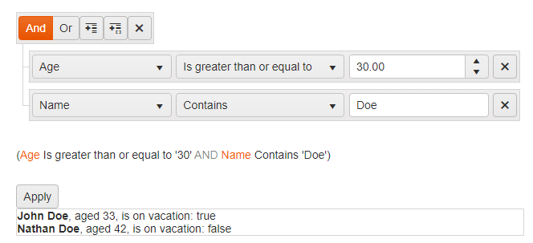

# Filter Overview

The [Kendo UI Filter widget](http://demos.telerik.com/kendo-ui/filter/index) is a unified control that you can use to filter all databound controls that have a [data source](/api/javascript/data/datasource).

Filter UI can be especially useful for databound widgets that do not have built-in UI for filtering but have a requirement to be filterable, such as a listview, chart or scheduler.

You can add or remove fields to filter by, select the global logic for applying them (`AND` or `OR`), and choose the filter operator for each field (for example, `contains`, `equals`). You can apply the filtering through a built-in button, or through an API call. You can choose the name by which the fields are shown to the user, and you can also localize the filter operators.



## Initialize the Filter

To create a Kendo UI Filter, use an empty `div` element and supply its settings in the initialization script.

The following example shows how to tie a filter to a data source and show the filtered data in a listview. You can also see how to use human-readable names for the fields and how to set an initial [filter expression](/api/javascript/ui/javascript/data/datasource/configuration/filter).

```dojo
<div id="filter"></div>
<ul id="listView"></ul>

<script type="text/x-kendo-template" id="item">
    <li>
        <strong>#= name #</strong>, aged #= age #, is on vacation: #= isOnLeave #
    </li>
</script>

<script>
    $(document).ready(function () {
        var dataSource = new kendo.data.DataSource({
            data: [
                { name: "Jane Doe", age: "25", isOnLeave: false },
                { name: "John Doe", age: "33", isOnLeave: true },
                { name: "John Smith", age: "37", isOnLeave: true },
                { name: "Nathan Doe", age: 42, isOnLeave: false }
            ],
            schema: {
                model: {
                    fields: {
                        name: { type: "string" },
                        age: { type: "number" },
                        isOnLeave: { type: "boolean" }
                    }
                }
            }
        });

        $("#filter").kendoFilter({
            dataSource: dataSource,
            expressionPreview: true, // shows a text preview of the filter expression
            applyButton: true, // shows the built-in Apply button
            fields: [ // defining the fields is not mandatory, they will otherwise be taken from the datasource schema
            // if you define the fields, their names and types must match the data source definition
                { name: "name", type: "string", label: "Name" },
                { name: "age", type: "number", label: "Age" },
                { name: "isOnLeave", type: "boolean", label: "On Vacation" }
            ],
            expression: { // defining an initial filter expression is not required
                logic: "and",
                filters: [
                    { field: "age", value: 30, operator: "gte" },
                    { field: "name", value: "Doe", operator: "contains" }
                ]
            }
        }).data("kendoFilter").applyFilter(); 
        // we chain the method call to apply filtering immediately after the widget initialization because there is an initial filter set

        $("#listView").kendoListView({
            dataSource: dataSource,
            template: kendo.template($("#item").html())
        });
    });
</script>
```

>tip You can use a remote data source instead of a local array of data. The local array is used for brevity in this example.
>
> Providing the fields is not required, the filter widget can take them from the data source. If you do not set the fields in the filter settings, the actual field names will be displayed to the uesr, not the human-readable `label`. If you set the fields, they must match the schema of the data source.
>
> Providing an initial filter expression is not required. This feature can be useful for [restoring previous state]().


## Referencing Existing Instances

To refer to an existing TimeLine instance use the `jQuery.data()` method. Once a reference is established, use the [Filter widget API](/api/javascript/ui/timeline) to control its behavior.

```
var filter = $("#theFilter").data("kendoFilter");
```

## Events

You can find a list of the available events in the [Filter Widget API reference](/api/javascript/ui/timeline#events).

## See Also

* [Kendo UI Filter Basics (Demo)](https://demos.telerik.com/kendo-ui/filter/index)
* [Binding the Filter over MVVM (Demo)](https://demos.telerik.com/kendo-ui/filter/mvvm)
* [Kendo UI Filter Editor Template (Demo)](https://demos.telerik.com/kendo-ui/filter/custom-editors)
* [Kendo UI Filter Persist State (Demo)](https://demos.telerik.com/kendo-ui/filter/persist-state)
* [Persist State]()
* [JavaScript API Reference](/api/javascript/ui/timeline)

