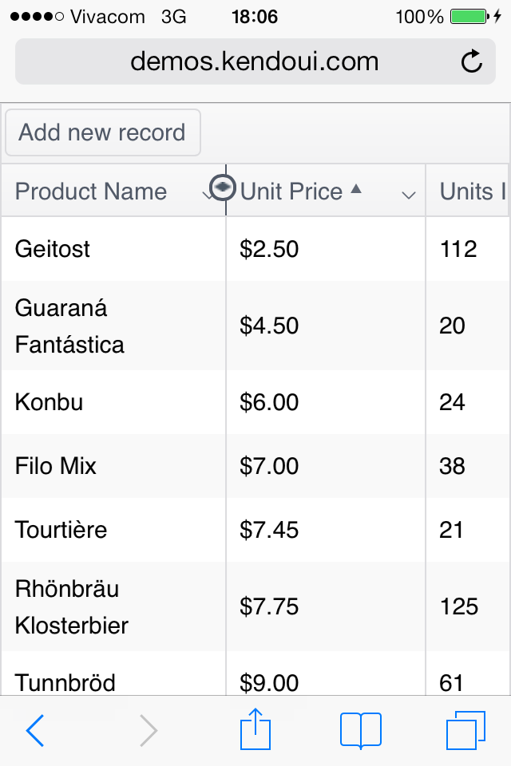

# Adaptive Rendering

The Kendo UI Grid for jQuery provides consistency to the customer experience on any device by supporting adaptive enhancements.

For example, when you filter or edit data on mobile, Kendo UI slides in a new screen for the user, which is a departure from the desktop-like inline and popup behaviors. To see these features in action, refer to the [adaptive rendering demo](https://demos.telerik.com/kendo-ui/grid/adaptive-rendering).

## Enabling Responsive Design

To enable the adaptive rendering feature, set the [`mobile`](/api/javascript/ui/grid/configuration/mobile) property to `true` or `phone`.

```dojo
    <div id="grid"></div>
    <script>
    $("#grid").kendoGrid({
       columns: [
         { field: "name" },
         { field: "age" },
         { command: "destroy" }
       ],
       dataSource: [
         { name: "Jane Doe", age: 30 },
         { name: "John Doe", age: 33 }
       ],
       filterable: true,
       columnMenu: true,
       height: 550,
       mobile: true
    });
    </script>
```

## Configuring Panes on Mobile

The mobile pane in which the adaptive Grid is placed does not automatically expand its height. To add an adaptive Grid to a Kendo UI mobile application, set the `stretch` configuration of the respective view to `true` and apply an `auto` height to the Grid. Alternatively, define an explicit pixel Grid height and omit the pane `stretch` option.

The following example demonstrates how to apply the `stretch` option.

```dojo
    <div id="foo" data-role="view" data-init="onInit" data-stretch="true">
        <div id="grid"></div>
    </div>

    <script>
        var gridConfig = {
            columns: [
                { field: "name" },
                { field: "age" },
                { command: "destroy" }
            ],
            dataSource: [
                { name: "Jane Doe", age: 30 },
                { name: "John Doe", age: 33 }
            ],
            filterable: true,
            columnMenu: true,
            mobile: "phone",
            height: "auto"
        };

        function onInit() {
            $("#grid").kendoGrid(gridConfig);
        }

        var app = new kendo.mobile.Application();
    </script>
```

The following example demonstrates how to apply the `height` option.

```dojo
    <div id="foo" data-role="view" data-init="onInit">
        <div id="grid"></div>
    </div>

    <script>
        var gridConfig = {
            columns: [
                { field: "name" },
                { field: "age" },
                { command: "destroy" }
            ],
            dataSource: [
                { name: "Jane Doe", age: 30 },
                { name: "John Doe", age: 33 }
            ],
            filterable: true,
            columnMenu: true,
            mobile: "phone",
            height: "140px" //grid will be 140px height
        };

        $("#grid").kendoGrid(gridConfig);
    </script>
```

### Resizing of Columns

The column resizing feature on touch screen devices is triggered when the user holds a finger on the respective column header. When the resizing icon appears, the user can resize the column by dragging.

**Figure 1: A Grid with resizable columns on a mobile device**



## Applying Styles to Parent Grid Elements

The suggested approach applies to the following cases:
* When multiple adaptive Grids are used on the same page.
* When the Grid is not the only content on the page.

Each adaptive Grid is rendered inside a separate mobile pane. Because the position of the panes is absolute, they overlap. To avoid pane overlapping, wrap each Grid inside a `<div>` container that is relatively positioned and has a set height. The absolute position is required for the proper functioning of the transition between main and edit views.

The following example demonstrates how to add multiple adaptive Grids to the same page.

```dojo
    <div class="adaptive-grid-wrapper">
        <div id="grid1"></div>
    </div>

    <div class="adaptive-grid-wrapper">
        <div id="grid2"></div>
    </div>
    <style>
        .adaptive-grid-wrapper {
            position: relative;
            height: 130px;
         }
    </style>
    <script>
        var gridConfig = {
            columns: [
                { field: "name" },
                { field: "age" },
                { command: "destroy" }
            ],
            dataSource: [
                { name: "Jane Doe", age: 30 },
                { name: "John Doe", age: 33 }
            ],
            filterable: true,
            columnMenu: true,
            mobile: "phone"
        };

        $("#grid1").kendoGrid(gridConfig);
        $("#grid2").kendoGrid(gridConfig);
    </script>
```

## Destroying Adaptive Grids

When in adaptive mode, the Grid generates auxiliary markup which needs to be removed if the widget is to be [destroyed]() manually.

To manually destroy the Grid:

1. Call [`kendo.destroy()`](/api/javascript/kendo/methods/destroy) over the closest `.k-pane-wrapper` ancestor which is created around the Grid widget.
1. Remove the whole `.k-pane-wrapper` element from the DOM.

To recreate the Grid, insert a new `<div>` at the same place where the previous Grid `<div>` was initially placed.

## See Also

* [Implementing Responsive Columns in the Grid (Demo)](https://demos.telerik.com/kendo-ui/grid/responsive-columns)
* [JavaScript API Reference of the Grid](/api/javascript/ui/grid)
* [Kendo UI Knowledge Base](/knowledge-base)
