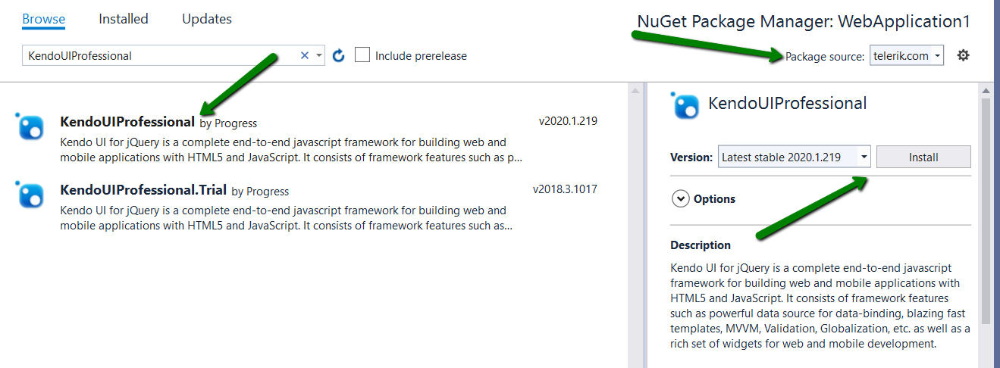

# Installing with NuGet

Telerik maintains a NuGet Feed for registered users.

[NuGet](https://www.nuget.org) is a popular .NET package manager. Official releases and service packs of Kendo UI are available for registered users.

The NuGet Feed provides the following NuGet packages:
* `KendoUIProfessional`&mdash;Kendo UI for jQuery Commercial version.
* `KendoUIProfessional.Trial`&mdash;Kendo UI for jQuery Trial version.
* `KendoUICore`&mdash;Kendo UI Core (contains only the Core widgets).

## The Telerik Private NuGet Feed

To use the Telerik NuGet Feed as a Package Source, use the [NuGet CLI](http://docs.nuget.org/consume/Command-Line-Reference). As of now, Visual Studio does not provide a UI for configuring authenticated NuGet feeds.

### Setting Up the NuGet Package Source

1. Download the [latest NuGet executable](https://dist.nuget.org/win-x86-commandline/latest/nuget.exe).
1. Open a command prompt and change the path to where the `nuget.exe` is downloaded.
1. Depending on your scenario, execute the following commands respectively.

  * To store encrypted credentials, use the `NuGet Sources Add -Name "telerik.com" -Source "https://nuget.telerik.com/nuget" -UserName "your login email" -Password "your password"` command. As a result, a token is stored in the `%AppData%\NuGet\NuGet.config` file. Your original credentials cannot be obtained from this token.

    > If you are unable to connect to the feed by using encrypted credentials, try the alternative approach of storing credentials in clear text.

  * To store credentials in clear text, use the `NuGet Sources Add -Name "telerik.com" -Source "https://nuget.telerik.com/nuget" -UserName "your login email" -Password "your password" -StorePasswordInClearText` command. As a result, the password is stored in clear text in the `%AppData%\NuGet\NuGet.config` file. If you are unable to connect to the feed using encrypted credentials, use this alternative approach.

    If you have already stored a token instead of storing the credentials as clear text, update the definition in the `%AppData%\NuGet\NuGet.config` file by using the `NuGet Sources Update -Name "telerik.com" -Source "https://nuget.telerik.com/nuget" -UserName "your login email" -Password "your password" -StorePasswordInClearText` command.

### Installing the NuGet Packages

After setting up the source, install the packages either through the [Package Manager Dialog](#installing-with-package-manager-dialog) or through the [Package Manager Console](#installing-with-package-manager-console).

#### Installing with Package Manager Dialog

1. Right click on the Solution or specific project in a Solution and navigate to `Manage NuGet Packages`.

    

1. Set the package source to `telerik.com` and install the `KendoUIProfessional` NuGet Package. 

     

#### Installing with Package Manager Console

1. Open the project/solution in Visual Studio, and open the console using the **Tools > NuGet Package Manager > Package Manager Console** command.

1. Run the install command:

```
    Install-Package KendoUIProfessional -ProjectName WebApplication
```

> Substitute `WebApplication` with the name of your project.

#### Resources Location

After installing the packages, the content scripts and stylesheets are copied to your application as follows:
* `/Scripts/kendo/<version>/`&mdash;Contains the minified JavaScript files.
* `/Content/kendo/<version>/`&mdash;Contains the minified CSS files and theme images.

    

## Next Steps

* [Create your own custom bundles]()
* [Learn about the widget DOM element structure]()
* [Initialize widgets as jQuery plugins]()
* [Initialize widgets with MVVM]()
* [Check out the jQuery version support]()
* [Check out the web browser support]()
* [Check out the operation system support]()
* [Check out the PDF and Excel export support]()
* [Explore the widget script dependencies]()
* [Create your own custom widgets]()

## See Also

* [Hosting Kendo UI in Your Project]()
* [Installing Kendo UI with Bower]()
* [Installing Kendo UI by Using the CDN Services]()
* [Installing Kendo UI with NPM]()
* [Getting Up and Running with Your Kendo UI Project (Guide)]()
