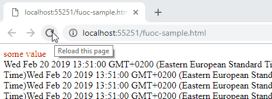
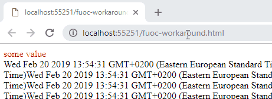

## Environment

<table>
 <tr>
  <td>Product</td>
  <td>Progress Kendo UI for jQuery, UI for ASP.NET MVC, UI for ASP.NET Core</td>
 </tr>
  <tr>
  <td>Version</td>
  <td>All versions</td>
 </tr>
</table>


## Description

Flash of unstyled content (commonly abbreviated as FUOC) is the effect where the user can see parts of the page in their non-styled or partially styled state before all styles and/or scripts that cater to the desired appearance are loaded and/or run.

###### Figure 1: Flash of Unstyled Content (FUOC) simulation



At the end of the article you will find a code snippet that simulates the FUOC effect.

This can commonly happen for one or more reasons such as:

* network latency in loading stylehseets
* large DOM that makes jQuery widget initialization slow
* slow user machine
* asynchronous or deferred scripts that also apply styling

With the Kendo widgets, you are more likely to experience such issues with ones that hide the user input altogether such as a DropDownList or ComboBox. This also applies to the ASP.NET MVC and ASP.NET Core suites because they also [create jQuery widgets](https://docs.telerik.com/aspnet-mvc/getting-started/kendo-ui-vs-mvc-wrappers) behind the scenes.

Kendo widgets are [instantiated only after the document has been loaded and parsed](https://docs.telerik.com/kendo-ui/controls/navigation/panelbar/overview#initialization).  At this point the necessary classes are added and the browser can style them according to the stylesheets that are present (in this case - the Kendo stylesheets are most relevant as they are the targetted appearance).

Example symptoms pertainint to the Kendo widgets:

* I have a combobox that shows as a normal text box and shows the model data until the datasource is loaded.
* I am using dropdownlist for and when the page first loads if that dropdownlist has a value it briefly shows the value of the selected option instead of text.
* Using a panelBar causes flashes of unstyled content.

## Workaround

Generally speaking, some minor flickers are inevitable when a web page loads because there is always a lot of content for the browser to process and the wire delays also play a role in when assets will be available. Deferred and async scripts can also produce similar effects as they wait for the rest of the page to load before loading and executing.

Thus, speeding up initialization can be done by reducing the initial DOM size and speeding up asset loading (e.g., by using bunding and/or CDN services, depending on which works better for the intended audience).

You can also add CSS rules that alleviate or fix the issue as early as possible so that the initial content will be rendered in an acceptable manner (for example, add some Kendo classes to the markup if you instantiate the widgets from markup so they can be styled before the widgets are instantiated - this can work better for containers like the panelbar or the menu).

For inputs, you can make the text transparent and unselectable, for example, so users can't actually see it and interact with it.

###### Figure 2: FUOC Workaround




```
input.myHiddenText {
    color: transparent;
    user-select:none;
}
```

where this is to be added to the inputs that exhibit such issues (for example, that become dropdowns, but not ones that need to keep showing the value such as textboxes):

```
<input value="some value" class="myHiddenText" />
```

For HTML helpers in MVC, you can add the class through the `HtmlAttributes`: `.HtmlAttributes(new { @class="myHiddenText"})`

Note that the `myHiddenText` class will be rendered on both the input, and the Kendo widget wrapper so you must ensure it does not break the appearance of the widget.


## Simulation

````
<!DOCTYPE html>
<html>
<head>
    <meta charset="utf-8" />
    <title></title>
	<script src="https://code.jquery.com/jquery-3.3.1.min.js"></script>
	<style>
		.testDiv span {
			color: red;
		}

		.testDiv.dynamicClass input {
			display: none;
		}

		/* uncomment for workaround */
		/*
		input.myHiddenText {
			color: transparent;
			user-select: none;
		}
		*/
	</style>
</head>
<body>
	<div class="testDiv">
		<input value="some value" class="myHiddenText" />
	</div>
	<div id="complexWork"></div>
	<script>
		$(document).ready(function () {
			//a very crude FUOC simulation - a lot of heavy DOM operations that mimic
			//a heavy page with many widgets and a lot of reflows happening before
			//the "widget" below instantiates and hides the input
			//if you don't see the input flash briefly, increase the number of iterations
			for (var i = 0; i < 1000; i++) {
				$("#complexWork").html($("#complexWork").html() + new Date());
			}
			//sample jQuery widget that hides the input and uses its value to change the DOM around it
			$(".testDiv").append("<span>" + $(".testDiv").find("input").first().val() + "</span>").addClass("dynamicClass");
		});
	</script>
</body>
</html>
````


